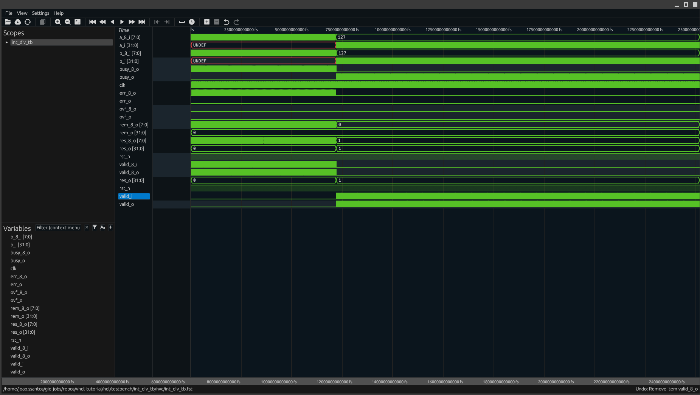

# VHDL Integer Division Example

## Introduction

This project provides an example VHDL module, **`int_div.vhd`**, that implements integer division on binary numbers. The purpose of this module is to demonstrate how to perform binary division at the RTL level in VHDL (without using the built-in `/` operator), producing a *quotient* and *remainder* as outputs. It serves as a teaching example of the classic binary division algorithm in hardware. A corresponding VHDL testbench is included in the repository to verify the functionality of the `int_div` module, so you can run simulations and observe the results immediately.

## Binary Division Implementation Overview

The `int_div` module realizes binary division using an **iterative shift-and-subtract algorithm**, similar to the manual long division process for binary numbers. In each iteration, the divisor is shifted into alignment with the current *partial remainder* of the dividend and a subtraction is attempted. If the subtraction does not result in a negative value, it means the divisor "fits" in the current remainder – the subtraction result is kept and a `1` is recorded in the corresponding quotient bit. If the subtraction would go negative, the divisor is too large for that step – the subtraction is undone (restored) and a `0` is recorded in the quotient bit. The divisor is then shifted (typically one bit to the right) for the next iteration, and the process repeats for the number of bits in the dividend. After all iterations, the quotient bits assembled during the process form the final quotient output, and the final value in the partial remainder register represents the division remainder.

This division implementation is **iterative**, meaning it uses a loop or finite-state machine over multiple clock cycles (rather than a single large combinational divide). As a result, the hardware usage is minimal – essentially one subtractor and a few registers for the dividend, divisor, and accumulating quotient. The design efficiently reuses the subtract-and-shift logic across iterations, trading time (several cycles per division) for a much smaller circuit.

**Handling signed values:** The module is designed to handle signed integers as well. It typically does so by converting any negative inputs to their absolute values, performing the division on non-negative magnitudes, and then adjusting the sign of the quotient (and/or remainder) at the end of the computation. In other words, the algorithm itself operates on unsigned magnitudes, and additional logic applies the correct sign to the results after the division is done. This approach ensures that the division works for both positive and negative operands, at the cost of a few extra steps of logic (e.g. flipping bits and adding 1 for two's complement negation of the result). The remainder is often defined to have the same sign as the dividend in a signed division. By handling the sign bits explicitly, `int_div.vhd` provides correct quotient and remainder outputs for all combinations of signed or unsigned inputs.

## Simulation with *hdlmake* and NVC

To build and run the simulation of the `int_div` module, this project uses **hdlmake** (a build automation tool for HDL projects) alongside **NVC** (Nick’s VHDL Compiler, an open-source VHDL simulator). **hdlmake** will generate all the necessary build files (Makefiles) and manage VHDL file dependencies for the simulation, while **NVC** will compile and simulate the VHDL code.

Follow the steps below to prepare the project and execute the testbench using hdlmake and NVC:

1. **Navigate to the project directory**
   Open a terminal and change directory to the location of the project’s top-level `Manifest.py` (the hdlmake manifest that describes the simulation). For example:

   ```bash
   cd hdl/testbench/int_div_tb
   ```

2. **Generate the build files with hdlmake**
   Run the `hdlmake` command in that directory:

   ```bash
   hdlmake
   ```

   This command will automatically create a Makefile tailored for the simulation setup. The Makefile includes all VHDL source files (the `int_div.vhd` module, the testbench, and any required libraries) in the correct compilation order.

3. **Run the simulation using make (NVC)**
   Use the generated Makefile to compile and run the testbench:

   ```bash
   cd nvc
   make
   ```

   The testbench will be executed using NVC, and a waveform dump file (in `.fst` format) will be generated if configured in the manifest.

4. **Simulation output**
   During the simulation, NVC will apply test vectors and output results to the console. If everything runs successfully, you'll see the correct values for quotient and remainder for each test case.
      ```bash
    nvc --work=work --std=2008 -a   ../../../modules/int_div.vhd
    nvc --work=work --std=2008 -a   ../int_div_tb.vhd
    nvc --std=2008 -e --no-collapse int_div_tb
    nvc -r --dump-arrays --exit-severity=error int_div_tb --wave=int_div_tb.fst --format=fst
    ** Note: ********: All 8-bit division cases passed successfully.
    Process :int_div_tb:_p1 at ../int_div_tb.vhd:135
    ** Note: ********: All 32-bit randomized test cases passed (50,000 total).
    Process :int_div_tb:_p1 at ../int_div_tb.vhd:135
    ** Note: ********: FINISH called
    Procedure FINISH [] at ...
    Process :int_div_tb:_p1 at ...
   ```

## Viewing the Waveforms with *Surfer*

After running the testbench, you can visualize the results using **Surfer**, a fast and modern waveform viewer.

To view the waveform:

- **Open Surfer** and load the waveform file (e.g. `int_div_tb.fst`) using the GUI or via command line:

  ```bash
  surfer int_div_tb.fst
  ```

- **Inspect the signals**
  Add relevant signals to the waveform window such as `dividend`, `divisor`, `quotient`, and `remainder`. You should see how these values evolve during the simulation and verify correct operation for each division.

## Expected Waveform Results
Below is a captured waveform showing a successful division of 127 by 127:



####  Input and Operation Start
- **a_i, b_i** (`a_i[7:0]`, `b_i[7:0]`): Inputs to the divider. In this example, both are set to `127`.
- **valid_i**: Goes high to indicate the inputs are valid and a division operation should begin.

#### Operation Control
- **busy_o**: High during processing, returns to `0` when division completes.
- **rst_n**: Active-low reset. Initially low, then deasserted to allow normal operation.

#### Division Result
- **res_o** (`res_o[7:0]`): Quotient output. For `127 / 127`, this correctly results in `1`.
- **rem_o** (`rem_o[7:0]`): Remainder output. For `127 / 127`, the remainder is `0`.
- **valid_o**: Goes high to indicate that `res_o` and `rem_o` are valid.

#### Status Flags
- **err_o, ovf_o**: Error and overflow flags. Remain low in a successful division.

